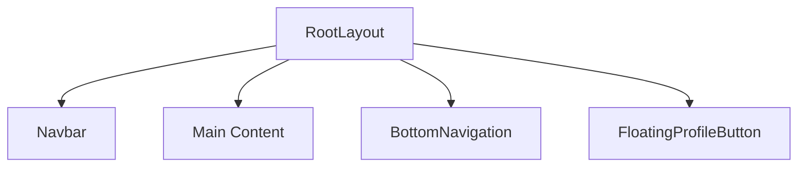
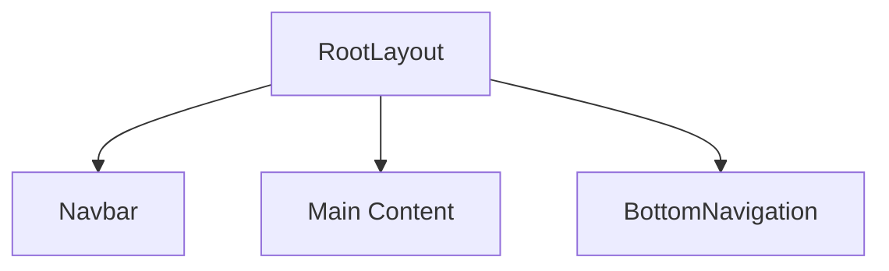
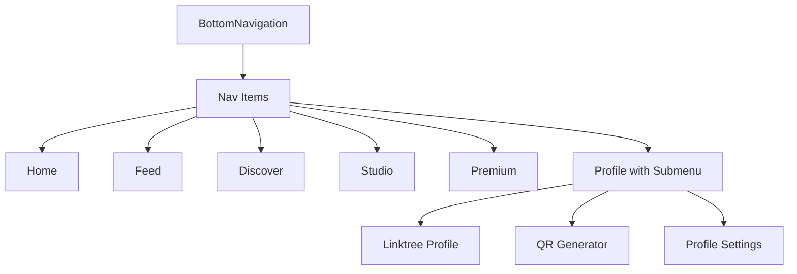

# Profil Butonları Düzenlemesi

## 1. Genel Bakış

Bu tasarım belgesi, HOYN uygulamasında profil butonlarıyla ilgili yapılması istenen değişiklikleri detaylandırır. Şu anda giriş yaptıktan sonra iki farklı profil butonu görünmekte:

1. **Alt paneldeki profil butonu**: Yeri doğru, kalacak
2. **Sağ alttaki profil butonu (FloatingProfileButton)**: İçeriği doğru ama yeri yanlış

### Hedef
- Sağ alttaki profil butonunu tamamen kaldırma
- Alt paneldeki profil butonuna, sağ alttakinin içeriğini ekleme
- Sonuç olarak giriş sonrası sadece alt panelde tek bir profil butonu olacak ve bu buton doğru içerikle çalışacak

## 2. Mevcut Durum Analizi

### 2.1. FloatingProfileButton Bileşeni
Sağ alt köşede sabitlenmiş durumda ve şu işlevlere sahip:
- QR Oluştur butonu: `/dashboard/qr-generator` sayfasına yönlendirir
- Profil butonu: `/dashboard/linktree` sayfasına yönlendirir
- Ana buton tıklanınca menüyü açar/kapatır (toggle)

### 2.2. BottomNavigation Bileşeni
Alt panelde sabitlenmiş durumda ve şu menü öğelerine sahip:
- Ana Sayfa
- Akış
- Keşfet
- Studio
- Premium (sadece premium kullanıcılar için)
- Profil: `/dashboard/profile` sayfasına yönlendirir

### 2.3. Uygulama Düzeni (Layout)
Her iki bileşen de `src/app/layout.tsx` dosyasında kök düzene dahil edilmiş durumda:
```tsx
<main className="min-h-screen pt-16 pb-20">{children}</main>
<BottomNavigation />
<FloatingProfileButton />
```

## 3. Tasarım Değişiklikleri

### 3.1. Kaldırılacak Bileşen
- `FloatingProfileButton` bileşeni tamamen kaldırılacak
- İlgili dosya: `src/components/ui/FloatingProfileButton.tsx`

### 3.2. Güncellenecek Bileşen
`BottomNavigation` bileşeni aşağıdaki şekilde güncellenecek:

#### 3.2.1. Yeni Menü Yapısı
Mevcut profil butonu yerine genişletilebilir bir menü sistemi eklenecek:

1. **Profil** menü öğesi tıklanınca açılır menü gösterecek
2. Açılır menüde şu seçenekler olacak:
   - Linktree Profil (mevcut profil sayfası)
   - QR Oluştur
   - Profil Ayarları (mevcut profil düzenleme sayfası)

#### 3.2.2. Yönlendirmeler
- Linktree Profil: `/dashboard/linktree`
- QR Oluştur: `/dashboard/qr-generator`
- Profil Ayarları: `/dashboard/profile`

### 3.3. Gerekli Kod Değişiklikleri

#### 3.3.1. BottomNavigation.tsx Güncellemeleri
1. `NavItem` arayüzüne yeni bir alan eklenecek: `submenu?: NavItem[]`
2. Profil öğesi için alt menü tanımlanacak
3. Açılır menü gösterimi için state yönetimi eklenecek
4. Açılır menü stil ve animasyonları tanımlanacak

#### 3.3.2. Layout.tsx Güncellemeleri
1. `FloatingProfileButton` bileşeni kaldırılacak
2. Sadece `BottomNavigation` bileşeni kalacak

## 4. Bileşen Diyagramları

### 4.1. Mevcut Yapı


### 4.2. Yeni Yapı


### 4.3. BottomNavigation Bileşen Yapısı


## 5. Uygulama Adımları

### 5.1. 1. Adım: FloatingProfileButton Bileşenini Kaldırma
! Manuel yapman lazım: `src/components/ui/FloatingProfileButton.tsx` dosyasını sil

! Manuel yapman lazım: `src/app/layout.tsx` dosyasını şu şekilde güncelle:

```tsx
// src/app/layout.tsx
import Navbar from '@/components/Navbar';
import BottomNavigation from '@/components/BottomNavigation';
import { ThemeProvider } from '@/components/providers/ThemeProvider';
import { SubscriptionProvider } from '@/components/providers/SubscriptionProvider';
import '@/styles/globals.css';

export default function RootLayout({
  children,
}: { children: React.ReactNode }) {
  return (
    <html lang="tr">
      <body className="bg-black text-white">
        <ThemeProvider>
          <SubscriptionProvider>
            <Navbar />
            <main className="min-h-screen pt-16 pb-20">{children}</main>
            <BottomNavigation />
          </SubscriptionProvider>
        </ThemeProvider>
      </body>
    </html>
  );
}
```

### 5.2. 2. Adım: BottomNavigation Bileşenini Güncelleme
1. `NavItem` arayüzüne `submenu` alanını ekle:

```tsx
interface NavItem {
  id: string;
  label: string;
  icon: string;
  path?: string;
  activeIcon?: string;
  submenu?: NavItem[];
}
```

2. Profil öğesi için alt menü tanımla:

```tsx
{
  id: 'profile',
  label: 'Profil',
  icon: '👤',
  activeIcon: '👤',
  submenu: [
    {
      id: 'linktree',
      label: 'Linktree Profil',
      icon: '👤',
      path: '/dashboard/linktree'
    },
    {
      id: 'qr-generator',
      label: 'QR Oluştur',
      icon: '📱',
      path: '/dashboard/qr-generator'
    },
    {
      id: 'settings',
      label: 'Profil Ayarları',
      icon: '⚙️',
      path: '/dashboard/profile'
    }
  ]
}
```

3. Açılır menü state'ini yönetmek için `useState` ekle:

```tsx
const [openSubmenu, setOpenSubmenu] = useState<string | null>(null);
```

4. Açılır menü render'ı için gerekli JSX'i ekle:

```tsx
// Profil butonuna tıklanınca alt menüyü aç/kapat
const toggleSubmenu = (itemId: string) => {
  setOpenSubmenu(openSubmenu === itemId ? null : itemId);
};

// Menü dışında bir yere tıklanınca menüyü kapat
useEffect(() => {
  const handleClickOutside = () => {
    if (openSubmenu) {
      setOpenSubmenu(null);
    }
  };

  document.addEventListener('click', handleClickOutside);
  return () => {
    document.removeEventListener('click', handleClickOutside);
  };
}, [openSubmenu]);
```

5. Açılır menü stil ve animasyonlarını tanımla:

```tsx
{/* Açılır menü */}
{item.submenu && openSubmenu === item.id && (
  <div className="absolute bottom-16 flex flex-col space-y-2 bg-black/90 backdrop-blur-lg border border-purple-900/50 rounded-xl p-2">
    {item.submenu.map((subItem) => (
      <button
        key={subItem.id}
        onClick={(e) => {
          e.stopPropagation();
          if (subItem.path) {
            handleNavigation(subItem.path);
            setOpenSubmenu(null);
          }
        }}
        className="flex items-center space-x-2 p-2 rounded-lg hover:bg-purple-900/50 transition-colors duration-200"
      >
        <span>{subItem.icon}</span>
        <span className="text-xs whitespace-nowrap">{subItem.label}</span>
      </button>
    ))}
  </div>
)}
```

### 5.3. 3. Adım: Stil ve Animasyonlar
1. Açılır menü için gerekli CSS sınıflarını tanımla
2. Hover ve active durumları için geçiş efektleri ekle
3. Responsive davranışları kontrol et

### 5.4. 4. Adım: BottomNavigation Bileşeninin Tamamını Güncelleme

! Manuel yapman lazım: `src/components/BottomNavigation.tsx` dosyasını şu şekilde güncelle:

```tsx
// src/components/BottomNavigation.tsx
'use client';

import { useState, useEffect } from 'react';
import { useRouter, usePathname } from 'next/navigation';
import { useAuth } from '@/hooks/useAuth';
import { useSubscription } from '@/components/providers/SubscriptionProvider';

interface NavItem {
  id: string;
  label: string;
  icon: string;
  path?: string;
  activeIcon?: string;
  submenu?: NavItem[];
}

export default function BottomNavigation() {
  const { user } = useAuth();
  const { hasPremiumAccess } = useSubscription();
  const router = useRouter();
  const pathname = usePathname();
  const [openSubmenu, setOpenSubmenu] = useState<string | null>(null);

  // Menü dışında bir yere tıklanınca menüyü kapat
  useEffect(() => {
    const handleClickOutside = () => {
      if (openSubmenu) {
        setOpenSubmenu(null);
      }
    };

    document.addEventListener('click', handleClickOutside);
    return () => {
      document.removeEventListener('click', handleClickOutside);
    };
  }, [openSubmenu]);

  // Don't show navigation if user is not authenticated
  if (!user) return null;

  const navItems: NavItem[] = [
    {
      id: 'home',
      label: 'Ana Sayfa',
      icon: '🏠',
      activeIcon: '🏠',
      path: '/dashboard'
    },
    {
      id: 'feed',
      label: 'Akış',
      icon: '📁',
      activeIcon: '📰',
      path: '/feed'
    },
    {
      id: 'discover',
      label: 'Keşfet',
      icon: '🔍',
      activeIcon: '🔍',
      path: '/discover'
    },
    {
      id: 'create',
      label: 'Studio',
      icon: '🎨',
      activeIcon: '✨',
      path: '/studio'
    },
    // Add Premium link for users with premium access
    ...(hasPremiumAccess ? [{
      id: 'premium',
      label: 'Premium',
      icon: '💎',
      activeIcon: '🌟',
      path: '/premium'
    }] : []),
    {
      id: 'profile',
      label: 'Profil',
      icon: '👤',
      activeIcon: '👤',
      submenu: [
        {
          id: 'linktree',
          label: 'Linktree Profil',
          icon: '👤',
          path: '/dashboard/linktree'
        },
        {
          id: 'qr-generator',
          label: 'QR Oluştur',
          icon: '📱',
          path: '/dashboard/qr-generator'
        },
        {
          id: 'settings',
          label: 'Profil Ayarları',
          icon: '⚙️',
          path: '/dashboard/profile'
        }
      ]
    }
  ];

  const isActive = (path: string) => {
    if (path === '/dashboard') {
      return pathname === '/dashboard';
    }
    return pathname.startsWith(path);
  };

  const handleNavigation = (path: string) => {
    router.push(path);
  };

  // Profil butonuna tıklanınca alt menüyü aç/kapat
  const toggleSubmenu = (itemId: string) => {
    setOpenSubmenu(openSubmenu === itemId ? null : itemId);
  };

  return (
    <nav className="fixed bottom-0 left-0 right-0 z-50 bg-black/95 backdrop-blur-lg border-t border-purple-900/50">
      <div className="max-w-md mx-auto">
        <div className="flex items-center justify-around py-2 relative">
          {navItems.map((item) => {
            const active = isActive(item.path || '');
            const displayIcon = active ? (item.activeIcon || item.icon) : item.icon;
            
            return (
              <div key={item.id} className="relative">
                <button
                  onClick={() => {
                    if (item.submenu) {
                      toggleSubmenu(item.id);
                    } else if (item.path) {
                      handleNavigation(item.path);
                    }
                  }}
                  className={`flex flex-col items-center justify-center p-2 transition-all duration-200 ${
                    active 
                      ? 'text-purple-400 scale-110' 
                      : 'text-gray-400 hover:text-gray-200 hover:scale-105'
                  }`}
                  aria-label={item.label}
                >
                  <span className={`text-xl mb-1 transition-all duration-200 ${
                    active ? 'drop-shadow-[0_0_8px_rgba(168,85,247,0.6)]' : ''
                  }`}>
                    {displayIcon}
                  </span>
                  <span className={`text-xs font-medium transition-all duration-200 ${
                    active ? 'text-purple-300' : 'text-gray-500'
                  }`}>
                    {item.label}
                  </span>
                  
                  {/* Active indicator */}
                  {active && (
                    <div className="absolute -top-0.5 w-1 h-1 bg-purple-400 rounded-full animate-pulse"></div>
                  )}
                </button>
                
                {/* Açılır menü */}
                {item.submenu && openSubmenu === item.id && (
                  <div className="absolute bottom-16 flex flex-col space-y-2 bg-black/90 backdrop-blur-lg border border-purple-900/50 rounded-xl p-2 min-w-[140px]">
                    {item.submenu.map((subItem) => (
                      <button
                        key={subItem.id}
                        onClick={(e) => {
                          e.stopPropagation();
                          if (subItem.path) {
                            handleNavigation(subItem.path);
                            setOpenSubmenu(null);
                          }
                        }}
                        className="flex items-center space-x-2 p-2 rounded-lg hover:bg-purple-900/50 transition-colors duration-200"
                      >
                        <span>{subItem.icon}</span>
                        <span className="text-xs whitespace-nowrap">{subItem.label}</span>
                      </button>
                    ))}
                  </div>
                )}
              </div>
            );
          })}
        </div>
      </div>
    </nav>
  );
}
```

## 6. Test Senaryoları

### 6.1. Fonksiyonellik Testleri
- [ ] Kullanıcı giriş yaptıktan sonra sadece bir profil butonu görünmeli
- [ ] Profil butonuna tıklandığında alt menü açılmalı
- [ ] Alt menüdeki "Linktree Profil" seçeneği doğru sayfaya yönlendirmeli
- [ ] Alt menüdeki "QR Oluştur" seçeneği doğru sayfaya yönlendirmeli
- [ ] Alt menüdeki "Profil Ayarları" seçeneği doğru sayfaya yönlendirmeli
- [ ] Menü dışında bir yere tıklandığında menü kapanmalı
- [ ] Alt menü açıkken ESC tuşu ile menü kapanmalı (ek özellik)

### 6.2. Görsel Testler
- [ ] Alt menü doğru konumda görünmeli (profil butonunun hemen üzerinde)
- [ ] Alt menü öğeleri doğru sıralama ve tasarımda olmalı
- [ ] Animasyonlar düzgün çalışmalı
- [ ] Responsive davranışlar doğru olmalı
- [ ] Menü öğeleri farklı ekran boyutlarında doğru konumlanmalı

### 6.3. Erişilebilirlik Testleri
- [ ] Klavye ile navigasyon mümkün olmalı
- [ ] ARIA etiketleri doğru ayarlanmalı
- [ ] Ekran okuyucular için uygun olmalı
- [ ] Focus yönetimi doğru çalışmalı

## 7. Güvenlik ve Performans

### 7.1. Güvenlik
- Kullanıcı kimlik doğrulaması kontrolü korunacak
- Yönlendirmeler güvenli şekilde yapılacak
- Event listener'lar doğru şekilde temizlenecek

### 7.2. Performans
- Eklenen state'ler minimal olacak
- Gereksiz render'lar önlenilecek
- CSS animasyonları optimize edilecek
- Menü açılıp kapanışları için smooth transition'lar uygulanacak

## 8. Geri Dönüşülebilirlik Planı

Eğer bu değişikliklerde beklenmedik sorunlar oluşursa:
1. `FloatingProfileButton.tsx` dosyasını geri yükle
2. `layout.tsx` dosyasına eski halini geri ekle
3. `BottomNavigation.tsx` dosyasını önceki haline döndür

### 8.1. Yedekleme Önerileri
- `BottomNavigation.tsx` dosyasının yedeğini al
- `layout.tsx` dosyasının yedeğini al
- `FloatingProfileButton.tsx` dosyasını silmeden önce yedeğini al

### 8.2. Geri Alma Adımları
1. `git stash` veya `git checkout` komutlarıyla orijinal dosyaları geri yükle
2. Gerekirse `git revert` komutu ile commit'i geri al